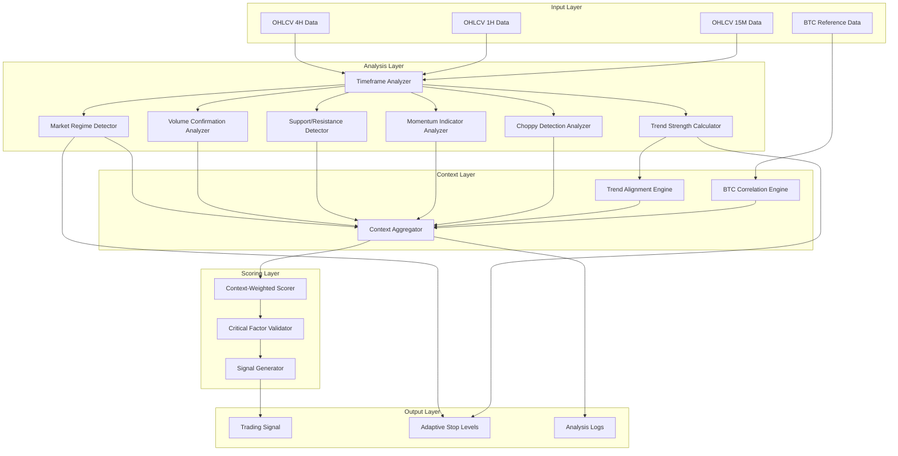

# Enhanced Multi-Timeframe Context-Aware TA System - Design Document

## Overview

This design document describes an enhanced technical analysis system that addresses critical limitations in the current TA implementation. The system provides comprehensive market context awareness through multi-timeframe trend alignment, trend strength quantification, market regime detection, volume confirmation, and adaptive risk management.

The core problem being solved: the current system enters LONG positions when lower timeframes show DOWN trends, leading to consistent losses. This enhanced system requires proper trend alignment and context validation before generating signals.

## Architecture



## Components and Interfaces

### 1. TimeframeAnalyzer

Analyzes individual timeframe data and calculates all technical indicators.

```python
class TimeframeAnalyzer:
    def analyze(self, ohlcv: List[OHLCV]) -> TimeframeAnalysis:
        """Analyze a single timeframe and return all indicators."""
        pass
```

**Output: TimeframeAnalysis**
- ema_9, ema_21, ema_50: float
- rsi: float
- macd_line, macd_signal, macd_histogram: float
- atr: float
- atr_average: float
- volume_ratio: float
- trend_direction: TrendDirection (UP, DOWN, SIDEWAYS)
- trend_strength: TrendStrength (STRONG, MODERATE, WEAK)

### 2. TrendStrengthCalculator

Quantifies trend strength based on EMA separation.

```python
class TrendStrengthCalculator:
    def calculate(self, ema_9: float, ema_21: float, price: float) -> TrendStrength:
        """Calculate trend strength from EMA separation percentage."""
        separation_pct = abs(ema_9 - ema_21) / price * 100
        if separation_pct > 1.0:
            return TrendStrength.STRONG
        elif separation_pct > 0.3:
            return TrendStrength.MODERATE
        else:
            return TrendStrength.WEAK
```

### 3. MarketRegimeDetector

Classifies current market conditions.

```python
class MarketRegimeDetector:
    def detect(self, analysis_4h: TimeframeAnalysis, 
               analysis_1h: TimeframeAnalysis,
               ohlcv: List[OHLCV]) -> MarketRegime:
        """Detect market regime from volatility and price action."""
        pass
```

**Output: MarketRegime**
- TRENDING: Strong aligned trends across timeframes
- SIDEWAYS: Price ranging within 2% for 20 candles
- HIGH_VOLATILITY: ATR > 150% of average
- LOW_VOLATILITY: ATR < 50% of average
- CHOPPY: Frequent EMA crossings

### 4. TrendAlignmentEngine

Calculates weighted trend alignment across timeframes.

```python
class TrendAlignmentEngine:
    WEIGHTS = {"4h": 0.50, "1h": 0.30, "15m": 0.20}
    
    def calculate_alignment(self, 
                           trend_4h: TrendDirection,
                           trend_1h: TrendDirection,
                           trend_15m: TrendDirection) -> TrendAlignment:
        """Calculate weighted trend alignment score."""
        pass
```

**Output: TrendAlignment**
- alignment_score: float (0.0 to 1.0)
- is_aligned: bool
- dominant_direction: TrendDirection
- conflict_penalty: int

### 5. VolumeConfirmationAnalyzer

Validates price movements with volume.

```python
class VolumeConfirmationAnalyzer:
    def analyze(self, volume_ratio: float, 
                volume_trend: List[float],
                price_change: float) -> VolumeConfirmation:
        """Analyze volume confirmation for price movement."""
        pass
```

**Output: VolumeConfirmation**
- is_confirmed: bool
- volume_score: int
- is_declining: bool
- is_false_move: bool

### 6. SupportResistanceDetector

Identifies key price levels.

```python
class SupportResistanceDetector:
    def detect(self, ohlcv: List[OHLCV], 
               current_price: float) -> SupportResistance:
        """Detect support and resistance levels."""
        pass
```

**Output: SupportResistance**
- nearest_support: float
- nearest_resistance: float
- at_support: bool
- at_resistance: bool
- is_breakout: bool

### 7. ContextWeightedScorer

Calculates final confidence score with weights.

```python
class ContextWeightedScorer:
    WEIGHTS = {
        "trend_alignment": 0.30,
        "trend_strength": 0.20,
        "volume_confirmation": 0.15,
        "momentum": 0.15,
        "support_resistance": 0.10,
        "market_regime": 0.10
    }
    
    def calculate_score(self, context: MarketContext) -> ConfidenceScore:
        """Calculate weighted confidence score."""
        pass
```

### 8. CriticalFactorValidator

Validates critical factors that can veto signals.

```python
class CriticalFactorValidator:
    def validate(self, context: MarketContext) -> ValidationResult:
        """Validate critical factors for signal generation."""
        # Critical factors that can veto:
        # - Trend alignment failure
        # - Volume below 80% average
        # - Choppy market conditions
        # - Weak 4H trend strength
        # - Sideways regime
        pass
```

### 9. AdaptiveStopCalculator

Calculates stop losses based on regime and trend strength.

```python
class AdaptiveStopCalculator:
    REGIME_MULTIPLIERS = {
        MarketRegime.TRENDING: 1.5,
        MarketRegime.HIGH_VOLATILITY: 2.5,
        MarketRegime.LOW_VOLATILITY: 1.0,
    }
    
    STRENGTH_MULTIPLIERS = {
        TrendStrength.STRONG: 1.2,
        TrendStrength.MODERATE: 1.5,
        TrendStrength.WEAK: 2.0,
    }
    
    def calculate(self, atr: float, regime: MarketRegime, 
                  strength: TrendStrength) -> float:
        """Calculate adaptive stop loss distance."""
        pass
```

## Data Models

```python
from enum import Enum
from dataclasses import dataclass
from typing import Optional, Dict, List

class TrendDirection(Enum):
    UP = "UP"
    DOWN = "DOWN"
    SIDEWAYS = "SIDEWAYS"

class TrendStrength(Enum):
    STRONG = "STRONG"
    MODERATE = "MODERATE"
    WEAK = "WEAK"

class MarketRegime(Enum):
    TRENDING = "TRENDING"
    SIDEWAYS = "SIDEWAYS"
    HIGH_VOLATILITY = "HIGH_VOLATILITY"
    LOW_VOLATILITY = "LOW_VOLATILITY"
    CHOPPY = "CHOPPY"

class SignalConfidence(Enum):
    HIGH = "HIGH"  # > 80
    MEDIUM = "MEDIUM"  # 65-80
    LOW = "LOW"  # < 65 (no signal)

@dataclass
class TimeframeAnalysis:
    timeframe: str
    ema_9: float
    ema_21: float
    ema_50: float
    rsi: float
    macd_line: float
    macd_signal: float
    macd_histogram: float
    atr: float
    atr_average: float
    volume_ratio: float
    trend_direction: TrendDirection
    trend_strength: TrendStrength

@dataclass
class TrendAlignment:
    alignment_score: float
    is_aligned: bool
    dominant_direction: TrendDirection
    conflict_penalty: int
    alignment_bonus: int

@dataclass
class VolumeConfirmation:
    is_confirmed: bool
    volume_score: int
    is_declining: bool
    is_false_move: bool

@dataclass
class SupportResistance:
    nearest_support: float
    nearest_resistance: float
    at_support: bool
    at_resistance: bool
    is_breakout: bool
    sr_score: int

@dataclass
class MomentumAnalysis:
    rsi_valid: bool
    macd_score: int
    has_divergence: bool
    momentum_score: int

@dataclass
class MarketContext:
    trend_alignment: TrendAlignment
    trend_strength_4h: TrendStrength
    market_regime: MarketRegime
    volume_confirmation: VolumeConfirmation
    support_resistance: SupportResistance
    momentum: MomentumAnalysis
    is_choppy: bool
    btc_correlation_adjustment: int

@dataclass
class ConfidenceScore:
    total_score: int
    component_scores: Dict[str, int]
    confidence_level: SignalConfidence
    critical_factors_passed: bool
    veto_reason: Optional[str]

@dataclass
class EnhancedSignal:
    symbol: str
    direction: str
    confidence: int
    confidence_level: SignalConfidence
    entry_price: float
    stop_loss: float
    take_profit: float
    market_context: MarketContext
    component_scores: Dict[str, int]
```

## Correctness Properties

*A property is a characteristic or behavior that should hold true across all valid executions of a system-essentially, a formal statement about what the system should do. Properties serve as the bridge between human-readable specifications and machine-verifiable correctness guarantees.*

### Property 1: Trend Conflict Penalty
*For any* market state where the 4H trend is UP and the 1H trend is DOWN, the calculated long confidence score SHALL be reduced by at least 30% compared to a state where both trends are UP.
**Validates: Requirements 1.1**

### Property 2: Trend Alignment Bonus
*For any* market state where all three timeframes (4H, 1H, 15M) show the same trend direction, the confidence score SHALL include a 25-point alignment bonus.
**Validates: Requirements 1.2**

### Property 3: Conflicting Trend Signal Requirement
*For any* market state where 4H and 1H trends conflict, a signal SHALL only be generated if the 15M trend matches the 4H trend direction.
**Validates: Requirements 1.3**

### Property 4: Timeframe Weight Distribution
*For any* trend alignment calculation, the weights SHALL be distributed as: 4H=50%, 1H=30%, 15M=20%, and the sum of weights SHALL equal 100%.
**Validates: Requirements 1.4**

### Property 5: Trend Strength Classification
*For any* EMA9 and EMA21 values, the trend strength SHALL be classified as STRONG when separation > 1%, MODERATE when 0.3% < separation <= 1%, and WEAK when separation <= 0.3%.
**Validates: Requirements 2.2, 2.3, 2.4**

### Property 6: Weak 4H Trend Signal Block
*For any* market state where the 4H trend strength is WEAK, the system SHALL NOT generate any trading signals.
**Validates: Requirements 2.5**

### Property 7: Market Regime Classification
*For any* ATR and price data, the market regime SHALL be classified as HIGH_VOLATILITY when ATR > 150% average, LOW_VOLATILITY when ATR < 50% average, SIDEWAYS when price ranges within 2% for 20 candles, and TRENDING when trends are aligned with strong momentum.
**Validates: Requirements 3.1, 3.2, 3.3, 3.4**

### Property 8: Sideways Regime Signal Block
*For any* market state classified as SIDEWAYS regime, the system SHALL NOT generate trend-following signals.
**Validates: Requirements 3.5**

### Property 9: High Volatility Stop Adjustment
*For any* market state classified as HIGH_VOLATILITY regime, the stop loss distance SHALL be 50% wider than the base calculation.
**Validates: Requirements 3.6**

### Property 10: Minimum Volume Requirement
*For any* signal generation attempt, if volume is below 80% of the 20-period average, the signal SHALL be rejected.
**Validates: Requirements 4.1**

### Property 11: Volume Spike Bonus
*For any* market state where volume exceeds 150% of average during a trend move, the confidence score SHALL include a 15-point volume bonus.
**Validates: Requirements 4.2**

### Property 12: False Move Detection
*For any* market state where price moves significantly but volume is below 50% of average, the signal SHALL be rejected as a potential false move.
**Validates: Requirements 4.3**

### Property 13: RSI Range Validation
*For any* LONG signal, RSI SHALL be between 40 and 65. *For any* SHORT signal, RSI SHALL be between 35 and 60.
**Validates: Requirements 5.1, 5.2**

### Property 14: MACD Momentum Bonus
*For any* market state where MACD histogram is positive and increasing, LONG confidence SHALL receive a 10-point bonus. *For any* state where MACD histogram is negative and decreasing, SHORT confidence SHALL receive a 10-point bonus.
**Validates: Requirements 5.3, 5.4**

### Property 15: Support/Resistance Detection
*For any* price within 0.5% of a recent swing high, the system SHALL identify resistance. *For any* price within 0.5% of a recent swing low, the system SHALL identify support.
**Validates: Requirements 6.1, 6.2**

### Property 16: Support Entry Bonus
*For any* LONG entry near identified support, the confidence score SHALL include a 10-point bonus.
**Validates: Requirements 6.3**

### Property 17: Resistance Entry Penalty
*For any* LONG entry near identified resistance, the confidence score SHALL be reduced by 15 points.
**Validates: Requirements 6.4**

### Property 18: Regime-Based Stop Loss
*For any* TRENDING regime, stop loss SHALL be 1.5x ATR. *For any* HIGH_VOLATILITY regime, stop loss SHALL be 2.5x ATR. *For any* LOW_VOLATILITY regime, stop loss SHALL be 1.0x ATR.
**Validates: Requirements 7.1, 7.2, 7.3**

### Property 19: Trend-Strength-Based Stop Loss
*For any* STRONG trend strength, stop loss SHALL be 1.2x ATR. *For any* WEAK trend strength, stop loss SHALL be 2.0x ATR.
**Validates: Requirements 7.4, 7.5**

### Property 20: Confidence Weight Distribution
*For any* confidence calculation, the weights SHALL be: Trend Alignment=30%, Trend Strength=20%, Volume=15%, Momentum=15%, S/R=10%, Regime=10%, and the sum SHALL equal 100%.
**Validates: Requirements 8.1**

### Property 21: Minimum Confidence Threshold
*For any* confidence score below 65, the system SHALL NOT generate a signal.
**Validates: Requirements 8.2**

### Property 22: High Confidence Classification
*For any* confidence score above 80, the signal SHALL be classified as HIGH_CONFIDENCE.
**Validates: Requirements 8.3**

### Property 23: Critical Factor Veto
*For any* market state where trend alignment fails OR volume is below threshold, the signal SHALL be rejected regardless of total score.
**Validates: Requirements 8.4**

### Property 24: Choppy Market Detection
*For any* price data where price crosses EMA9 more than 4 times in 20 candles, the market SHALL be classified as CHOPPY.
**Validates: Requirements 9.1**

### Property 25: Choppy Market Signal Block
*For any* market state classified as CHOPPY, the system SHALL NOT generate signals.
**Validates: Requirements 9.2**

### Property 26: ADX Trend Override
*For any* market state where ADX is below 20, the trend SHALL be classified as WEAK regardless of EMA alignment.
**Validates: Requirements 9.3**

### Property 27: BTC Correlation Adjustment
*For any* altcoin analysis where BTC 4H trend is strongly DOWN, LONG confidence SHALL be reduced by 20 points. *For any* altcoin analysis where BTC 4H trend is strongly UP, SHORT confidence SHALL be reduced by 20 points.
**Validates: Requirements 10.2, 10.3**

### Property 28: BTC Volatility Signal Block
*For any* market state where BTC ATR exceeds 200% of average, the system SHALL NOT generate altcoin signals.
**Validates: Requirements 10.4**

## Error Handling

1. **Insufficient Data**: If any timeframe has fewer than 30 candles, raise `InsufficientDataError`
2. **Invalid Indicators**: If indicator calculations produce NaN or infinite values, use fallback values or skip signal
3. **API Failures**: If BTC data fetch fails, proceed without BTC correlation adjustment with logged warning
4. **Division by Zero**: Guard all percentage calculations against zero denominators

## Testing Strategy

### Property-Based Testing

The system will use **Hypothesis** as the property-based testing library for Python.

Each property-based test will:
- Run a minimum of 100 iterations
- Be tagged with the format: `**Feature: enhanced-ta-system, Property {number}: {property_text}**`
- Generate random but valid market states using custom strategies
- Verify the property holds across all generated inputs

### Test Categories

1. **Trend Alignment Tests**: Properties 1-4
2. **Trend Strength Tests**: Properties 5-6
3. **Market Regime Tests**: Properties 7-9
4. **Volume Tests**: Properties 10-12
5. **Momentum Tests**: Properties 13-14
6. **Support/Resistance Tests**: Properties 15-17
7. **Stop Loss Tests**: Properties 18-19
8. **Scoring Tests**: Properties 20-23
9. **Choppy Detection Tests**: Properties 24-26
10. **BTC Correlation Tests**: Properties 27-28

### Unit Tests

Unit tests will cover:
- Individual indicator calculations
- Edge cases (zero values, extreme values)
- Integration between components
- Signal generation flow

### Test Data Generators

Custom Hypothesis strategies will generate:
- Valid OHLCV data with realistic price movements
- Various trend configurations (aligned, conflicting)
- Different market regimes
- Volume patterns (spikes, declining, normal)
