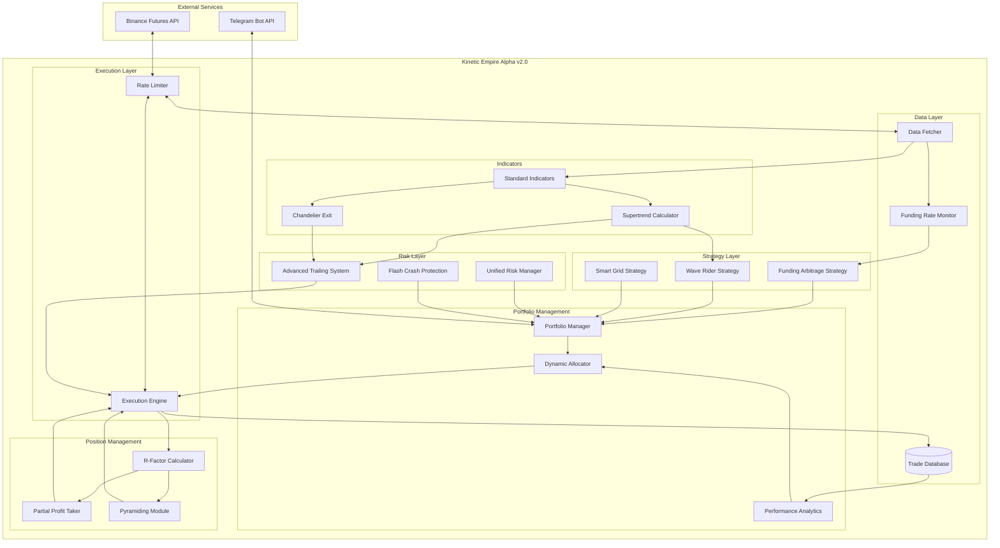

# Design Document: Kinetic Empire Alpha v2.0

## Overview

Kinetic Empire Alpha v2.0 is a multi-strategy cryptocurrency trading system that combines three complementary strategies into a unified portfolio: Funding Rate Arbitrage for stable income, Wave Rider for trend profits, and Smart Grid for range-bound markets. The system's core innovation is the R-Factor exit system that systematically books profits at predetermined risk multiples.

### Key Design Decisions

1. **Multi-Strategy Portfolio**: Diversification across uncorrelated strategies reduces overall risk
2. **R-Factor Profit Management**: Systematic profit-taking inspired by DayTraderAI
3. **Delta-Neutral Arbitrage**: Risk-free income stream from funding rate collection
4. **Adaptive Trailing Stops**: Multiple methods (ATR, Supertrend, Chandelier) for different conditions
5. **Dynamic Allocation**: Performance-based capital allocation across strategies

### Target Performance
- Annual Return: 50-80%
- Maximum Drawdown: <15%
- Sharpe Ratio: 3-4
- Win Rate: 70-85%

## Architecture



## Components and Interfaces

### 1. Funding Rate Arbitrage Strategy

**Responsibility**: Execute delta-neutral positions to collect funding rate payments.

```python
@dataclass
class ArbitrageConfig:
    min_funding_rate: float = 0.0001  # 0.01% per 8h = ~10% annual
    exit_funding_rate: float = 0.00005  # 0.005% per 8h = ~5% annual
    max_positions: int = 5
    position_size_pct: float = 0.08  # 8% of allocation per position

class FundingArbitrageStrategy:
    def __init__(self, config: ArbitrageConfig):
        self.config = config
        self.active_positions: Dict[str, ArbitragePosition] = {}
    
    def find_opportunities(self, funding_rates: Dict[str, float]) -> List[str]:
        """Find pairs with funding rate above threshold"""
        pass
    
    def open_arbitrage(self, pair: str, spot_client, futures_client) -> ArbitragePosition:
        """Open delta-neutral position: long spot + short perpetual"""
        pass
    
    def close_arbitrage(self, pair: str) -> float:
        """Close both legs simultaneously, return profit"""
        pass
    
    def check_exit_conditions(self, pair: str, current_funding: float) -> bool:
        """Check if funding rate dropped below exit threshold"""
        pass
    
    def calculate_collected_funding(self, position: ArbitragePosition) -> float:
        """Calculate total funding collected since position opened"""
        pass
```


### 2. R-Factor Calculator

**Responsibility**: Calculate and track profit in R-multiples for systematic position management.

```python
@dataclass
class RFactorPosition:
    pair: str
    side: str  # LONG or SHORT
    entry_price: float
    stop_loss: float
    r_value: float  # Dollar value of 1R
    current_r: float  # Current profit in R multiples
    peak_r: float  # Highest R achieved
    partial_exits: List[PartialExit]

class RFactorCalculator:
    def __init__(self):
        self.positions: Dict[str, RFactorPosition] = {}
    
    def calculate_r_value(self, entry: float, stop: float, side: str) -> float:
        """R = |entry - stop| for position sizing"""
        if side == "LONG":
            return entry - stop
        return stop - entry
    
    def calculate_current_r(self, position: RFactorPosition, current_price: float) -> float:
        """Current profit expressed as R multiple"""
        if position.side == "LONG":
            profit = current_price - position.entry_price
        else:
            profit = position.entry_price - current_price
        return profit / position.r_value
    
    def update_peak_r(self, position: RFactorPosition, current_r: float) -> None:
        """Track highest R achieved for profit-lock calculations"""
        position.peak_r = max(position.peak_r, current_r)
    
    def is_risk_free(self, position: RFactorPosition) -> bool:
        """Position is risk-free if we've taken profit at 1R"""
        return any(exit.r_level >= 1.0 for exit in position.partial_exits)
```

### 3. Partial Profit Taker

**Responsibility**: Automatically book partial profits at R-factor milestones.

```python
@dataclass
class ProfitTakeConfig:
    levels: List[Tuple[float, float]] = field(default_factory=lambda: [
        (1.0, 0.25),  # At 1R, take 25%
        (2.0, 0.25),  # At 2R, take 25%
        (3.0, 0.25),  # At 3R, take 25%
    ])
    move_stop_to_breakeven_at: float = 1.0
    trail_remaining: bool = True

class PartialProfitTaker:
    def __init__(self, config: ProfitTakeConfig):
        self.config = config
        self.taken_levels: Dict[str, Set[float]] = {}
    
    def check_profit_levels(self, position: RFactorPosition) -> Optional[PartialExit]:
        """Check if any profit level should be taken"""
        for r_level, pct in self.config.levels:
            if position.current_r >= r_level and r_level not in self.taken_levels.get(position.pair, set()):
                return PartialExit(r_level=r_level, percentage=pct)
        return None
    
    def execute_partial_exit(self, position: RFactorPosition, exit: PartialExit) -> Order:
        """Execute partial position close"""
        pass
    
    def should_move_stop_to_breakeven(self, position: RFactorPosition) -> bool:
        """Check if stop should be moved to breakeven"""
        return position.current_r >= self.config.move_stop_to_breakeven_at
    
    def get_remaining_position_pct(self, position: RFactorPosition) -> float:
        """Calculate remaining position after partial exits"""
        taken = sum(exit.percentage for exit in position.partial_exits)
        return 1.0 - taken
```

### 4. Advanced Trailing Stop System

**Responsibility**: Provide multiple trailing stop methods that adapt to market conditions.

```python
class TrailingMethod(Enum):
    ATR = "atr"
    SUPERTREND = "supertrend"
    CHANDELIER = "chandelier"
    PROFIT_LOCK = "profit_lock"

@dataclass
class AdvancedTrailingConfig:
    method: TrailingMethod = TrailingMethod.SUPERTREND
    atr_multiplier: float = 2.0
    supertrend_multiplier: float = 3.0
    chandelier_period: int = 22
    chandelier_multiplier: float = 3.0
    profit_lock_pct: float = 0.5  # Never give back more than 50% of peak

class AdvancedTrailingSystem:
    def __init__(self, config: AdvancedTrailingConfig):
        self.config = config
    
    def calculate_atr_stop(self, price: float, atr: float, side: str) -> float:
        """ATR-based trailing stop"""
        if side == "LONG":
            return price - (self.config.atr_multiplier * atr)
        return price + (self.config.atr_multiplier * atr)
    
    def calculate_supertrend_stop(self, df: DataFrame, side: str) -> float:
        """Supertrend-based trailing stop"""
        pass
    
    def calculate_chandelier_stop(self, df: DataFrame, atr: float, side: str) -> float:
        """Chandelier Exit trailing stop"""
        if side == "LONG":
            highest = df['high'].rolling(self.config.chandelier_period).max().iloc[-1]
            return highest - (self.config.chandelier_multiplier * atr)
        lowest = df['low'].rolling(self.config.chandelier_period).min().iloc[-1]
        return lowest + (self.config.chandelier_multiplier * atr)
    
    def calculate_profit_lock_stop(self, position: RFactorPosition, current_price: float) -> float:
        """Profit-lock stop: never give back more than X% of peak profit"""
        if position.peak_r <= 0:
            return position.stop_loss
        
        peak_profit = position.peak_r * position.r_value
        max_giveback = peak_profit * self.config.profit_lock_pct
        
        if position.side == "LONG":
            return position.entry_price + peak_profit - max_giveback
        return position.entry_price - peak_profit + max_giveback
    
    def get_best_stop(self, position: RFactorPosition, df: DataFrame) -> float:
        """Get the highest (most protective) stop from all methods"""
        stops = []
        atr = df['atr'].iloc[-1]
        current_price = df['close'].iloc[-1]
        
        stops.append(self.calculate_atr_stop(current_price, atr, position.side))
        stops.append(self.calculate_supertrend_stop(df, position.side))
        stops.append(self.calculate_chandelier_stop(df, atr, position.side))
        stops.append(self.calculate_profit_lock_stop(position, current_price))
        
        if position.side == "LONG":
            return max(stops)  # Highest stop for longs
        return min(stops)  # Lowest stop for shorts
```


### 5. Wave Rider Strategy

**Responsibility**: Capture extended trend moves using multi-timeframe alignment.

```python
class TrendStrength(Enum):
    STRONG_UPTREND = "strong_uptrend"
    WEAK_UPTREND = "weak_uptrend"
    NEUTRAL = "neutral"
    WEAK_DOWNTREND = "weak_downtrend"
    STRONG_DOWNTREND = "strong_downtrend"
    NO_TRADE = "no_trade"

@dataclass
class WaveRiderConfig:
    timeframes: List[str] = field(default_factory=lambda: ["1d", "4h", "1h", "15m"])
    ema_period: int = 21
    min_aligned_timeframes: int = 3
    entry_timeframe: str = "15m"
    roc_threshold: float = 0.5  # Minimum momentum for entry

class WaveRiderStrategy:
    def __init__(self, config: WaveRiderConfig):
        self.config = config
    
    def analyze_timeframe(self, df: DataFrame) -> str:
        """Analyze single timeframe trend: BULLISH, BEARISH, or NEUTRAL"""
        close = df['close'].iloc[-1]
        ema = df['ema'].iloc[-1]
        if close > ema * 1.001:  # 0.1% buffer
            return "BULLISH"
        elif close < ema * 0.999:
            return "BEARISH"
        return "NEUTRAL"
    
    def get_trend_alignment(self, timeframe_data: Dict[str, DataFrame]) -> TrendStrength:
        """Analyze trend across all timeframes"""
        trends = {tf: self.analyze_timeframe(df) for tf, df in timeframe_data.items()}
        
        bullish_count = sum(1 for t in trends.values() if t == "BULLISH")
        bearish_count = sum(1 for t in trends.values() if t == "BEARISH")
        
        if bullish_count == len(self.config.timeframes):
            return TrendStrength.STRONG_UPTREND
        elif bearish_count == len(self.config.timeframes):
            return TrendStrength.STRONG_DOWNTREND
        elif bullish_count >= self.config.min_aligned_timeframes:
            return TrendStrength.WEAK_UPTREND
        elif bearish_count >= self.config.min_aligned_timeframes:
            return TrendStrength.WEAK_DOWNTREND
        return TrendStrength.NO_TRADE
    
    def check_pullback_entry(self, df: DataFrame, trend: TrendStrength) -> bool:
        """Check for pullback entry on entry timeframe"""
        close = df['close'].iloc[-1]
        ema = df['ema'].iloc[-1]
        roc = df['roc'].iloc[-1]
        
        if trend in [TrendStrength.STRONG_UPTREND, TrendStrength.WEAK_UPTREND]:
            # Long entry: price pulled back to EMA and bouncing
            return close > ema and close < ema * 1.02 and roc > self.config.roc_threshold
        elif trend in [TrendStrength.STRONG_DOWNTREND, TrendStrength.WEAK_DOWNTREND]:
            # Short entry: price rallied to EMA and rejecting
            return close < ema and close > ema * 0.98 and roc < -self.config.roc_threshold
        return False
    
    def generate_signal(self, timeframe_data: Dict[str, DataFrame]) -> Optional[Signal]:
        """Generate entry signal if conditions are met"""
        trend = self.get_trend_alignment(timeframe_data)
        entry_df = timeframe_data[self.config.entry_timeframe]
        
        if self.check_pullback_entry(entry_df, trend):
            side = "LONG" if "UPTREND" in trend.value else "SHORT"
            return Signal(pair=entry_df.name, side=side, strength=trend)
        return None
```

### 6. Pyramiding Module

**Responsibility**: Add to winning positions at key profit levels.

```python
@dataclass
class PyramidConfig:
    entry_r_level: float = 1.0  # Add at 1R profit
    add_size_pct: float = 0.5  # Add 50% of original size
    max_pyramids: int = 2
    pyramid_stop_at_entry: bool = True  # Stop for pyramid at original entry

class PyramidingModule:
    def __init__(self, config: PyramidConfig):
        self.config = config
        self.pyramid_counts: Dict[str, int] = {}
    
    def should_pyramid(self, position: RFactorPosition, trend: TrendStrength) -> bool:
        """Check if position should be pyramided"""
        count = self.pyramid_counts.get(position.pair, 0)
        if count >= self.config.max_pyramids:
            return False
        if position.current_r < self.config.entry_r_level:
            return False
        # Only pyramid if trend is still strong
        if position.side == "LONG" and trend not in [TrendStrength.STRONG_UPTREND]:
            return False
        if position.side == "SHORT" and trend not in [TrendStrength.STRONG_DOWNTREND]:
            return False
        return True
    
    def calculate_pyramid_size(self, original_size: float) -> float:
        """Calculate size for pyramid addition"""
        return original_size * self.config.add_size_pct
    
    def calculate_pyramid_stop(self, position: RFactorPosition) -> float:
        """Calculate stop loss for pyramid portion"""
        if self.config.pyramid_stop_at_entry:
            return position.entry_price
        return position.stop_loss
    
    def execute_pyramid(self, position: RFactorPosition) -> Order:
        """Execute pyramid addition"""
        pass
    
    def update_average_entry(self, position: RFactorPosition, pyramid_price: float, 
                             pyramid_size: float) -> float:
        """Recalculate average entry after pyramid"""
        pass
```


### 7. Smart Grid Strategy

**Responsibility**: Execute volatility-adjusted, trend-biased grid trading.

```python
@dataclass
class SmartGridConfig:
    grid_count: int = 10
    atr_spacing_multiplier: float = 0.5  # Grid spacing = ATR * multiplier
    trend_bias: float = 0.6  # 60% of grids on trend side
    max_orders_per_pair: int = 10
    profit_target_pct: float = 0.05  # Close grid at 5% profit
    rebalance_threshold_atr: float = 2.0  # Rebalance if price moves 2 ATR from center

class SmartGridStrategy:
    def __init__(self, config: SmartGridConfig):
        self.config = config
        self.active_grids: Dict[str, GridState] = {}
    
    def calculate_grid_spacing(self, atr: float) -> float:
        """Calculate grid spacing based on ATR"""
        return atr * self.config.atr_spacing_multiplier
    
    def calculate_grid_levels(self, center_price: float, spacing: float, 
                              trend: TrendStrength) -> List[GridLevel]:
        """Calculate grid levels with trend bias"""
        levels = []
        
        if trend in [TrendStrength.STRONG_UPTREND, TrendStrength.WEAK_UPTREND]:
            # More buy levels below (60% below, 40% above)
            below_count = int(self.config.grid_count * self.config.trend_bias)
            above_count = self.config.grid_count - below_count
        elif trend in [TrendStrength.STRONG_DOWNTREND, TrendStrength.WEAK_DOWNTREND]:
            # More sell levels above (60% above, 40% below)
            above_count = int(self.config.grid_count * self.config.trend_bias)
            below_count = self.config.grid_count - above_count
        else:
            # Neutral: equal distribution
            below_count = above_count = self.config.grid_count // 2
        
        for i in range(1, below_count + 1):
            price = center_price - (i * spacing)
            levels.append(GridLevel(price=price, side='BUY'))
        
        for i in range(1, above_count + 1):
            price = center_price + (i * spacing)
            levels.append(GridLevel(price=price, side='SELL'))
        
        return levels
    
    def should_rebalance(self, grid: GridState, current_price: float, atr: float) -> bool:
        """Check if grid should be rebalanced around new price"""
        distance = abs(current_price - grid.center_price)
        return distance > (atr * self.config.rebalance_threshold_atr)
    
    def check_profit_target(self, grid: GridState) -> bool:
        """Check if grid profit target is reached"""
        return grid.total_profit >= (grid.allocated_capital * self.config.profit_target_pct)
```

### 8. Portfolio Manager

**Responsibility**: Coordinate strategies and manage capital allocation.

```python
@dataclass
class PortfolioConfig:
    initial_allocations: Dict[str, float] = field(default_factory=lambda: {
        'funding_arbitrage': 0.40,
        'wave_rider': 0.30,
        'smart_grid': 0.20,
        'reserve': 0.10
    })
    min_allocation: float = 0.10
    max_allocation: float = 0.60
    rebalance_threshold: float = 0.50  # Rebalance if Sharpe differs by 50%
    rebalance_amount: float = 0.05  # Move 5% allocation per rebalance

class PortfolioManager:
    def __init__(self, config: PortfolioConfig, total_capital: float):
        self.config = config
        self.total_capital = total_capital
        self.allocations = config.initial_allocations.copy()
        self.strategies: Dict[str, BaseStrategy] = {}
    
    def get_strategy_capital(self, strategy_name: str) -> float:
        """Get capital allocated to a strategy"""
        return self.total_capital * self.allocations.get(strategy_name, 0)
    
    def calculate_strategy_sharpe(self, strategy_name: str, lookback_days: int = 30) -> float:
        """Calculate rolling Sharpe ratio for a strategy"""
        pass
    
    def should_rebalance(self) -> bool:
        """Check if allocations should be rebalanced based on performance"""
        sharpes = {name: self.calculate_strategy_sharpe(name) for name in self.strategies}
        avg_sharpe = sum(sharpes.values()) / len(sharpes)
        
        for name, sharpe in sharpes.items():
            if abs(sharpe - avg_sharpe) / avg_sharpe > self.config.rebalance_threshold:
                return True
        return False
    
    def rebalance_allocations(self) -> None:
        """Adjust allocations based on strategy performance"""
        sharpes = {name: self.calculate_strategy_sharpe(name) for name in self.strategies}
        avg_sharpe = sum(sharpes.values()) / len(sharpes)
        
        for name, sharpe in sharpes.items():
            if sharpe > avg_sharpe * 1.5:  # Outperforming
                new_alloc = min(self.allocations[name] + self.config.rebalance_amount,
                               self.config.max_allocation)
                self.allocations[name] = new_alloc
            elif sharpe < avg_sharpe * 0.5:  # Underperforming
                new_alloc = max(self.allocations[name] - self.config.rebalance_amount,
                               self.config.min_allocation)
                self.allocations[name] = new_alloc
        
        # Normalize to ensure sum = 1.0
        total = sum(self.allocations.values())
        self.allocations = {k: v/total for k, v in self.allocations.items()}
    
    def run_cycle(self) -> List[Signal]:
        """Run one cycle of all strategies"""
        signals = []
        for name, strategy in self.strategies.items():
            capital = self.get_strategy_capital(name)
            strategy_signals = strategy.generate_signals(capital)
            signals.extend(strategy_signals)
        return signals
```


### 9. Unified Risk Manager

**Responsibility**: Enforce portfolio-level risk controls across all strategies.

```python
@dataclass
class RiskConfig:
    max_daily_var: float = 0.03  # 3% daily VaR limit
    max_drawdown: float = 0.15  # 15% max drawdown
    max_position_pct: float = 0.10  # 10% max single position
    max_strategy_correlation: float = 0.7
    daily_loss_limit: float = 0.05  # 5% daily loss triggers emergency
    cooldown_hours: int = 24  # Hours to halt after max drawdown

class UnifiedRiskManager:
    def __init__(self, config: RiskConfig):
        self.config = config
        self.peak_equity = 0.0
        self.daily_pnl = 0.0
        self.emergency_mode = False
        self.cooldown_until: Optional[datetime] = None
    
    def calculate_var(self, positions: List[Position], confidence: float = 0.95) -> float:
        """Calculate portfolio Value at Risk"""
        # Simplified VaR calculation using position sizes and volatilities
        pass
    
    def calculate_drawdown(self, current_equity: float) -> float:
        """Calculate current drawdown from peak"""
        self.peak_equity = max(self.peak_equity, current_equity)
        return (self.peak_equity - current_equity) / self.peak_equity
    
    def check_position_size(self, position_value: float, portfolio_value: float) -> bool:
        """Check if position size is within limits"""
        return position_value / portfolio_value <= self.config.max_position_pct
    
    def check_var_limit(self, positions: List[Position]) -> bool:
        """Check if VaR is within daily limit"""
        var = self.calculate_var(positions)
        return var <= self.config.max_daily_var
    
    def check_drawdown_limit(self, current_equity: float) -> bool:
        """Check if drawdown is within limit"""
        dd = self.calculate_drawdown(current_equity)
        if dd >= self.config.max_drawdown:
            self.emergency_mode = True
            self.cooldown_until = datetime.now() + timedelta(hours=self.config.cooldown_hours)
            return False
        return True
    
    def check_daily_loss(self, daily_pnl: float, portfolio_value: float) -> bool:
        """Check if daily loss limit is breached"""
        loss_pct = abs(daily_pnl) / portfolio_value if daily_pnl < 0 else 0
        if loss_pct >= self.config.daily_loss_limit:
            self.emergency_mode = True
            return False
        return True
    
    def can_trade(self) -> bool:
        """Check if trading is allowed"""
        if self.emergency_mode:
            if self.cooldown_until and datetime.now() > self.cooldown_until:
                self.emergency_mode = False
                return True
            return False
        return True
    
    def validate_trade(self, trade: Trade, portfolio: Portfolio) -> Tuple[bool, str]:
        """Validate a trade against all risk rules"""
        if not self.can_trade():
            return False, "Emergency mode active"
        
        if not self.check_position_size(trade.value, portfolio.total_value):
            return False, "Position size exceeds limit"
        
        if not self.check_var_limit(portfolio.positions + [trade]):
            return False, "VaR limit exceeded"
        
        return True, "OK"
```

### 10. Supertrend Indicator

**Responsibility**: Calculate Supertrend for trend detection and trailing stops.

```python
@dataclass
class SupertrendConfig:
    period: int = 10
    multiplier: float = 3.0

class SupertrendIndicator:
    def __init__(self, config: SupertrendConfig):
        self.config = config
    
    def calculate(self, df: DataFrame) -> DataFrame:
        """Calculate Supertrend indicator"""
        hl2 = (df['high'] + df['low']) / 2
        atr = df['atr'] if 'atr' in df.columns else self._calculate_atr(df)
        
        # Basic bands
        upper_band = hl2 + (self.config.multiplier * atr)
        lower_band = hl2 - (self.config.multiplier * atr)
        
        # Initialize
        supertrend = pd.Series(index=df.index, dtype=float)
        direction = pd.Series(index=df.index, dtype=int)  # 1 = up, -1 = down
        
        for i in range(1, len(df)):
            # Upper band logic (only decrease)
            if upper_band.iloc[i] < upper_band.iloc[i-1] or df['close'].iloc[i-1] > upper_band.iloc[i-1]:
                upper_band.iloc[i] = upper_band.iloc[i]
            else:
                upper_band.iloc[i] = upper_band.iloc[i-1]
            
            # Lower band logic (only increase)
            if lower_band.iloc[i] > lower_band.iloc[i-1] or df['close'].iloc[i-1] < lower_band.iloc[i-1]:
                lower_band.iloc[i] = lower_band.iloc[i]
            else:
                lower_band.iloc[i] = lower_band.iloc[i-1]
            
            # Determine trend
            if df['close'].iloc[i] > upper_band.iloc[i-1]:
                direction.iloc[i] = 1
            elif df['close'].iloc[i] < lower_band.iloc[i-1]:
                direction.iloc[i] = -1
            else:
                direction.iloc[i] = direction.iloc[i-1]
            
            # Set supertrend value
            if direction.iloc[i] == 1:
                supertrend.iloc[i] = lower_band.iloc[i]
            else:
                supertrend.iloc[i] = upper_band.iloc[i]
        
        df['supertrend'] = supertrend
        df['supertrend_direction'] = direction
        return df
    
    def get_stop(self, df: DataFrame, side: str) -> float:
        """Get current Supertrend stop level"""
        return df['supertrend'].iloc[-1]
    
    def get_trend(self, df: DataFrame) -> str:
        """Get current trend direction"""
        return "BULLISH" if df['supertrend_direction'].iloc[-1] == 1 else "BEARISH"
```


### 11. Funding Rate Monitor

**Responsibility**: Track funding rates across all perpetual pairs in real-time.

```python
@dataclass
class FundingData:
    pair: str
    current_rate: float  # Per 8 hours
    annualized_rate: float
    next_funding_time: datetime
    avg_7d_rate: float
    is_opportunity: bool

class FundingRateMonitor:
    def __init__(self, client: BinanceFuturesClient, min_rate: float = 0.0001):
        self.client = client
        self.min_rate = min_rate
        self.funding_data: Dict[str, FundingData] = {}
        self.history: Dict[str, List[Tuple[datetime, float]]] = {}
    
    def fetch_all_funding_rates(self) -> Dict[str, float]:
        """Fetch current funding rates for all perpetual pairs"""
        pass
    
    def calculate_annualized_rate(self, rate_8h: float) -> float:
        """Convert 8-hour rate to annualized"""
        return rate_8h * 3 * 365  # 3 funding periods per day
    
    def update_funding_data(self) -> None:
        """Update funding data for all pairs"""
        rates = self.fetch_all_funding_rates()
        for pair, rate in rates.items():
            annualized = self.calculate_annualized_rate(rate)
            avg_7d = self.calculate_7d_average(pair)
            
            self.funding_data[pair] = FundingData(
                pair=pair,
                current_rate=rate,
                annualized_rate=annualized,
                next_funding_time=self.get_next_funding_time(),
                avg_7d_rate=avg_7d,
                is_opportunity=rate >= self.min_rate
            )
    
    def get_opportunities(self) -> List[FundingData]:
        """Get pairs with funding rate above threshold"""
        return [fd for fd in self.funding_data.values() if fd.is_opportunity]
    
    def get_top_opportunities(self, n: int = 10) -> List[FundingData]:
        """Get top N pairs by funding rate"""
        sorted_data = sorted(self.funding_data.values(), 
                            key=lambda x: x.current_rate, reverse=True)
        return sorted_data[:n]
    
    def calculate_7d_average(self, pair: str) -> float:
        """Calculate 7-day average funding rate"""
        if pair not in self.history:
            return 0.0
        recent = [r for t, r in self.history[pair] if t > datetime.now() - timedelta(days=7)]
        return sum(recent) / len(recent) if recent else 0.0

## Data Models

```python
@dataclass
class ArbitragePosition:
    pair: str
    spot_entry_price: float
    futures_entry_price: float
    position_size: float
    open_time: datetime
    funding_collected: float = 0.0
    last_funding_time: Optional[datetime] = None

@dataclass
class PartialExit:
    r_level: float
    percentage: float
    exit_price: float
    exit_time: datetime
    profit: float

@dataclass
class Signal:
    pair: str
    side: str  # LONG or SHORT
    strategy: str
    strength: TrendStrength
    entry_price: Optional[float] = None
    stop_loss: Optional[float] = None
    take_profit: Optional[float] = None

@dataclass
class GridLevel:
    price: float
    side: str  # BUY or SELL
    order_id: Optional[str] = None
    filled: bool = False
    quantity: float = 0.0

@dataclass
class GridState:
    pair: str
    center_price: float
    levels: List[GridLevel]
    allocated_capital: float
    total_profit: float = 0.0
    completed_trades: int = 0
    active: bool = True

@dataclass
class StrategyPerformance:
    strategy_name: str
    total_trades: int
    winning_trades: int
    total_pnl: float
    sharpe_ratio: float
    max_drawdown: float
    avg_r_multiple: float
    win_rate: float
```

## Correctness Properties

*A property is a characteristic or behavior that should hold true across all valid executions of a system-essentially, a formal statement about what the system should do. Properties serve as the bridge between human-readable specifications and machine-verifiable correctness guarantees.*

### Property 1: Delta-Neutrality of Arbitrage Positions
*For any* arbitrage position, the absolute difference between spot position value and futures position value SHALL be less than 1% of total position value.
**Validates: Requirements 1.4**

### Property 2: R-Factor Calculation Correctness
*For any* position with entry_price and stop_loss, R_value SHALL equal |entry_price - stop_loss| and current_r SHALL equal (current_profit / R_value).
**Validates: Requirements 2.1, 2.2, 2.3**

### Property 3: Partial Profit Taking Sequence
*For any* position, partial exits SHALL occur in ascending R-level order (1R before 2R before 3R) and total percentage exited SHALL never exceed 100%.
**Validates: Requirements 3.1, 3.2, 3.3, 3.4**

### Property 4: Trailing Stop Monotonicity
*For any* long position, trailing stop SHALL only increase or stay the same, never decrease. For short positions, trailing stop SHALL only decrease or stay the same.
**Validates: Requirements 4.5**

### Property 5: Profit-Lock Constraint
*For any* position with profit-lock enabled, the trailing stop SHALL ensure maximum giveback is (peak_profit × profit_lock_pct).
**Validates: Requirements 4.4**

### Property 6: Multi-Timeframe Alignment
*For any* STRONG_UPTREND classification, all specified timeframes SHALL show price above EMA. For STRONG_DOWNTREND, all SHALL show price below EMA.
**Validates: Requirements 5.2, 5.3**

### Property 7: Pyramid Size Constraint
*For any* pyramid addition, the added size SHALL equal (original_size × add_size_pct) and total pyramids SHALL not exceed max_pyramids.
**Validates: Requirements 6.2, 6.5**

### Property 8: Grid Spacing Calculation
*For any* smart grid, spacing SHALL equal (ATR × spacing_multiplier) and total grid levels SHALL equal grid_count.
**Validates: Requirements 7.1**

### Property 9: Portfolio Allocation Bounds
*For any* strategy allocation, the value SHALL be within [min_allocation, max_allocation] and sum of all allocations SHALL equal 1.0.
**Validates: Requirements 8.5**

### Property 10: Risk Limit Enforcement
*For any* trade attempt when VaR exceeds max_daily_var OR drawdown exceeds max_drawdown, the trade SHALL be rejected.
**Validates: Requirements 9.2, 9.3**

### Property 11: Supertrend Band Ratcheting
*For any* Supertrend calculation, lower_band SHALL only increase (ratchet up) during uptrend, upper_band SHALL only decrease during downtrend.
**Validates: Requirements 13.5**

### Property 12: Chandelier Exit Calculation
*For any* long position Chandelier Exit, stop SHALL equal Highest_High(N) - (multiplier × ATR).
**Validates: Requirements 14.1**

### Property 13: Funding Rate Annualization
*For any* 8-hour funding rate, annualized_rate SHALL equal (rate_8h × 3 × 365).
**Validates: Requirements 10.4**

### Property 14: Emergency Mode Trigger
*For any* portfolio state where daily_loss >= daily_loss_limit OR drawdown >= max_drawdown, emergency_mode SHALL be True.
**Validates: Requirements 9.3, 9.6**


## Error Handling

### Arbitrage Execution Errors
- **Leg Imbalance**: If one leg fails to execute, immediately close the successful leg
- **Funding Collection Failure**: Log warning, retry on next cycle
- **Delta Drift**: If positions drift >2% from neutral, rebalance immediately

### Position Management Errors
- **Partial Exit Failure**: Retry 3 times, then close entire position
- **Stop Update Failure**: Use on-exchange stop as backup
- **Pyramid Rejection**: Log and continue without pyramid

### Portfolio Errors
- **Allocation Calculation Error**: Fall back to initial allocations
- **Strategy Timeout**: Skip strategy for current cycle, log warning
- **Database Connection Failure**: Queue trades in memory, persist when connection restored

### Exchange Errors
- **Rate Limit (429)**: Exponential backoff starting at 1 second
- **5xx Errors**: Enter FailSafe mode after 5 minutes
- **Order Rejection**: Log reason, adjust parameters, retry once

## Testing Strategy

### Unit Testing Framework
- **Framework**: pytest with pytest-asyncio
- **Coverage Target**: >80% line coverage
- **Mocking**: pytest-mock for exchange API calls

### Property-Based Testing Framework
- **Framework**: Hypothesis (Python)
- **Minimum Iterations**: 100 per property test
- **Annotation Format**: `**Feature: kinetic-empire-alpha, Property {N}: {description}**`

### Unit Test Coverage
1. **R-Factor Calculations**: Verify R calculation for long/short positions
2. **Partial Profit Logic**: Test profit-taking at each R level
3. **Trailing Stop Methods**: Test ATR, Supertrend, Chandelier calculations
4. **Supertrend Indicator**: Verify band calculations and trend flips
5. **Portfolio Allocation**: Test rebalancing logic
6. **Risk Limits**: Test VaR, drawdown, position size checks

### Property-Based Test Coverage
1. **Delta-Neutrality**: Generate random arbitrage positions, verify delta < 1%
2. **R-Factor Math**: Generate random entries/stops, verify R calculations
3. **Trailing Monotonicity**: Generate price sequences, verify stop never decreases (longs)
4. **Allocation Bounds**: Generate random Sharpe ratios, verify allocations in bounds
5. **Supertrend Ratcheting**: Generate OHLCV data, verify band behavior

### Integration Tests
1. **Arbitrage Flow**: Open/close arbitrage positions on testnet
2. **Partial Exit Flow**: Execute partial exits at R levels
3. **Multi-Strategy Coordination**: Run all strategies simultaneously
4. **Risk Enforcement**: Verify trades rejected when limits exceeded

