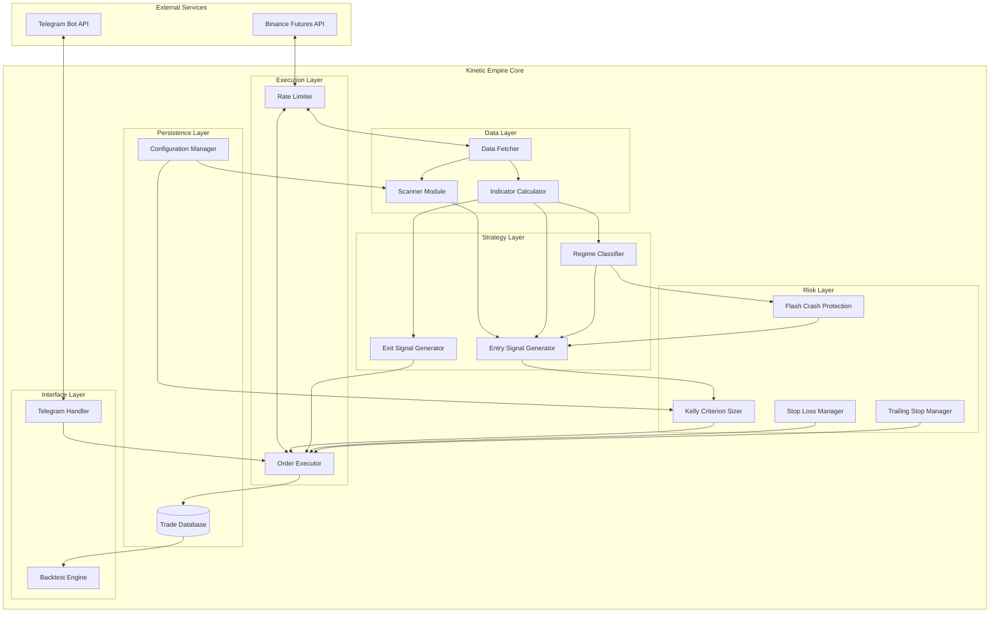

# Design Document: Kinetic Empire

## Overview

Kinetic Empire is a regime-aware, self-optimizing cryptocurrency trading system built on the Freqtrade framework. The system implements a multi-timeframe momentum strategy with dynamic position sizing based on Kelly Criterion and exposure management based on Bitcoin market regime.

The core philosophy is capital preservation first, profit second. The system reduces exposure during bearish conditions (max 3 trades when BTC < EMA50) and scales up during bullish conditions (max 20 trades). Position sizes are dynamically adjusted based on historical win rates per asset, rewarding consistent performers with larger allocations.

### Key Design Decisions

1. **Freqtrade Framework**: Leverages battle-tested infrastructure for exchange connectivity, backtesting, and strategy execution rather than building from scratch
2. **Multi-Timeframe Analysis**: Uses 5m for entries, 1h for trend confirmation, and daily for regime classification
3. **On-Exchange Stop Losses**: Critical for protection during bot downtime or API failures
4. **Kelly Criterion Sizing**: Mathematical approach to position sizing that maximizes long-term growth while managing risk
5. **Dynamic Pairlist**: Continuously discovers high-quality trading opportunities rather than static watchlist

## Architecture



## Components and Interfaces

### 1. Scanner Module

**Responsibility**: Filter exchange pairs to identify top 20 tradeable assets based on quality metrics.

```python
class ScannerModule:
    def __init__(self, config: ScannerConfig):
        self.blacklist_patterns: List[str]
        self.refresh_interval: int = 1800  # 30 minutes
        self.max_pairs: int = 20
    
    def scan(self, exchange_data: ExchangeData) -> List[str]:
        """Returns sorted list of top 20 pairs by volatility"""
        pass
    
    def apply_filters(self, pairs: List[PairData]) -> List[PairData]:
        """Applies filter pipeline: blacklist, volume, spread, price, volatility, performance"""
        pass
    
    def is_blacklisted(self, pair: str) -> bool:
        """Checks pair against blacklist patterns"""
        pass
```

**Filter Pipeline**:
1. Remove blacklisted pairs (regex matching)
2. Select top 70 by quote volume
3. Filter spread ratio <= 0.005
4. Filter price >= $0.001
5. Filter volatility in [0.02, 0.50]
6. Filter 60-min return > 0%
7. Sort by volatility descending, take top 20

### 2. Indicator Calculator Module

**Responsibility**: Calculate technical indicators on multiple timeframes.

```python
class IndicatorCalculator:
    def calculate_indicators(self, df: DataFrame, timeframe: str) -> DataFrame:
        """Adds indicator columns to dataframe"""
        pass
    
    def calculate_ema(self, series: Series, period: int) -> Series:
        """Exponential Moving Average"""
        pass
    
    def calculate_roc(self, series: Series, period: int) -> Series:
        """Rate of Change: (current - n_periods_ago) / n_periods_ago * 100"""
        pass
    
    def calculate_rsi(self, series: Series, period: int) -> Series:
        """Relative Strength Index: 100 - (100 / (1 + RS))"""
        pass
    
    def calculate_atr(self, df: DataFrame, period: int) -> Series:
        """Average True Range"""
        pass
    
    def merge_informative(self, df_5m: DataFrame, df_1h: DataFrame, df_daily: DataFrame) -> DataFrame:
        """Aligns higher timeframe data with 5m dataframe"""
        pass
```

### 3. Regime Classifier Module

**Responsibility**: Determine market regime based on BTC price relative to EMA50.

```python
class RegimeClassifier:
    def __init__(self):
        self.btc_pair: str = "BTC/USDT"
        self.ema_period: int = 50
    
    def classify(self, btc_daily_close: float, btc_ema50: float) -> Regime:
        """Returns BULL if close > ema50, else BEAR"""
        pass
    
    def get_max_trades(self, regime: Regime) -> int:
        """Returns 20 for BULL, 3 for BEAR"""
        pass

class Regime(Enum):
    BULL = "bull"
    BEAR = "bear"
```

### 4. Entry Signal Generator

**Responsibility**: Generate BUY signals when all conditions are met.

```python
class EntrySignalGenerator:
    def __init__(self, config: EntryConfig):
        self.roc_threshold: float = 1.5
        self.rsi_min: float = 45.0
        self.rsi_max: float = 65.0
    
    def check_entry_conditions(self, df: DataFrame, regime: Regime, open_trades: int) -> bool:
        """Returns True if all entry conditions are satisfied"""
        pass
    
    def check_macro_trend(self, close_1h: float, ema50_1h: float) -> bool:
        """1H close > 1H EMA50"""
        pass
    
    def check_micro_trend(self, close_5m: float, ema50_5m: float) -> bool:
        """5M close > 5M EMA50"""
        pass
    
    def check_momentum(self, roc: float) -> bool:
        """ROC > 1.5%"""
        pass
    
    def check_pullback(self, rsi: float) -> bool:
        """45 < RSI < 65"""
        pass
    
    def check_volume(self, current_volume: float, mean_volume_24h: float) -> bool:
        """Volume > 24h mean"""
        pass
```

### 5. Exit Signal Generator

**Responsibility**: Generate SELL signals on trend breaks.

```python
class ExitSignalGenerator:
    def check_exit_conditions(self, df: DataFrame, position: Position) -> ExitSignal:
        """Returns exit signal with reason if conditions met"""
        pass
    
    def check_trend_break(self, close_5m: float, ema50_5m: float, volume: float, mean_volume: float) -> bool:
        """Close < EMA50 AND Volume > Mean"""
        pass
    
    def check_stop_loss(self, current_price: float, stop_price: float) -> bool:
        """Price <= Stop Loss"""
        pass
```

### 6. Kelly Criterion Sizer

**Responsibility**: Calculate optimal position size based on historical performance.

```python
class KellyCriterionSizer:
    def __init__(self, config: SizingConfig):
        self.min_stake_pct: float = 0.5
        self.max_stake_pct: float = 5.0
        self.default_stake_pct: float = 1.0
        self.min_trades_for_kelly: int = 10
        self.lookback_trades: int = 20
        self.reward_risk_ratio: float = 2.0
    
    def calculate_stake(self, pair: str, available_balance: float, trade_history: List[Trade]) -> float:
        """Returns stake amount in quote currency"""
        pass
    
    def calculate_win_rate(self, trades: List[Trade]) -> float:
        """winning_trades / total_trades"""
        pass
    
    def calculate_kelly_fraction(self, win_rate: float, reward_risk_ratio: float) -> float:
        """(win_rate - (1 - win_rate) / reward_risk_ratio)"""
        pass
    
    def clamp_stake(self, stake_pct: float) -> float:
        """Clamps to [min_stake_pct, max_stake_pct]"""
        pass
```

### 7. Stop Loss Manager

**Responsibility**: Calculate and place ATR-based stop losses.

```python
class StopLossManager:
    def __init__(self, config: StopLossConfig):
        self.atr_multiplier: float = 2.0
    
    def calculate_stop_loss(self, entry_price: float, atr: float) -> float:
        """entry_price - (atr_multiplier * atr)"""
        pass
    
    def place_stop_order(self, pair: str, stop_price: float, amount: float) -> Order:
        """Places stop loss order on exchange"""
        pass
```

### 8. Trailing Stop Manager

**Responsibility**: Manage trailing stops for profitable positions.

```python
class TrailingStopManager:
    def __init__(self, config: TrailingConfig):
        self.activation_profit_pct: float = 2.5
        self.atr_multiplier: float = 1.5
    
    def should_activate(self, unrealized_profit_pct: float) -> bool:
        """profit_pct > activation_profit_pct"""
        pass
    
    def calculate_trailing_stop(self, current_price: float, atr: float) -> float:
        """current_price - (atr_multiplier * atr)"""
        pass
    
    def update_stop_if_higher(self, new_stop: float, current_stop: float) -> float:
        """Returns max(new_stop, current_stop) - monotonic increase only"""
        pass
```

### 9. Flash Crash Protection

**Responsibility**: Detect and respond to extreme market conditions.

```python
class FlashCrashProtection:
    def __init__(self, config: ProtectionConfig):
        self.crash_threshold_pct: float = 5.0
        self.crash_window_hours: int = 1
        self.recovery_hours: int = 4
    
    def detect_flash_crash(self, btc_prices: List[PricePoint]) -> bool:
        """Returns True if BTC dropped > 5% in last hour"""
        pass
    
    def is_market_stable(self, btc_prices: List[PricePoint], btc_ema50: float) -> bool:
        """Returns True if BTC > EMA50 for 4 consecutive hours"""
        pass
    
    def get_emergency_max_trades(self) -> int:
        """Returns 3 during flash crash"""
        pass
```

### 10. Trade Persistence Module

**Responsibility**: Store and retrieve trade data.

```python
class TradePersistence:
    def save_trade_open(self, trade: TradeOpen) -> None:
        """Persists: timestamp, pair, entry_price, stake_amount, regime"""
        pass
    
    def save_trade_close(self, trade: TradeClose) -> None:
        """Persists: timestamp, exit_price, profit_loss, exit_reason"""
        pass
    
    def get_trades_by_pair(self, pair: str, limit: int = 20) -> List[Trade]:
        """Returns recent trades for pair"""
        pass
    
    def get_trades_by_date_range(self, start: datetime, end: datetime) -> List[Trade]:
        """Returns trades in date range"""
        pass
    
    def serialize_trade(self, trade: Trade) -> str:
        """Converts trade to JSON string"""
        pass
    
    def deserialize_trade(self, json_str: str) -> Trade:
        """Converts JSON string to Trade object"""
        pass
```

## Data Models

```python
@dataclass
class PairData:
    symbol: str
    quote_volume: float
    spread_ratio: float
    price: float
    volatility: float
    return_60m: float

@dataclass
class TradeOpen:
    id: str
    timestamp: datetime
    pair: str
    entry_price: float
    stake_amount: float
    regime: Regime
    stop_loss: float

@dataclass
class TradeClose:
    trade_id: str
    timestamp: datetime
    exit_price: float
    profit_loss: float
    exit_reason: ExitReason

@dataclass
class Trade:
    id: str
    pair: str
    entry_timestamp: datetime
    entry_price: float
    stake_amount: float
    regime: Regime
    exit_timestamp: Optional[datetime]
    exit_price: Optional[float]
    profit_loss: Optional[float]
    exit_reason: Optional[ExitReason]
    is_winner: Optional[bool]

class ExitReason(Enum):
    TREND_BREAK = "trend_break"
    STOP_LOSS = "stop_loss"
    TRAILING_STOP = "trailing_stop"
    MANUAL = "manual"

@dataclass
class Position:
    pair: str
    entry_price: float
    current_price: float
    amount: float
    stop_loss: float
    trailing_stop_active: bool
    unrealized_profit_pct: float

@dataclass
class ScannerConfig:
    blacklist_patterns: List[str]
    refresh_interval: int
    max_pairs: int
    min_volume_rank: int
    max_spread: float
    min_price: float
    volatility_range: Tuple[float, float]

@dataclass
class BacktestResult:
    total_trades: int
    winning_trades: int
    losing_trades: int
    win_rate: float
    total_return_pct: float
    max_drawdown_pct: float
    sharpe_ratio: float
    trades: List[Trade]
```

## Correctness Properties

*A property is a characteristic or behavior that should hold true across all valid executions of a system-essentially, a formal statement about what the system should do. Properties serve as the bridge between human-readable specifications and machine-verifiable correctness guarantees.*

### Property 1: Scanner Filter Pipeline Correctness
*For any* set of exchange pairs, after applying the filter pipeline, all remaining pairs SHALL have: spread_ratio <= 0.005, price >= 0.001, volatility in [0.02, 0.50], and return_60m > 0, AND no pair SHALL match any blacklist pattern.
**Validates: Requirements 1.2, 1.3, 1.4, 1.5, 1.6**

### Property 2: Scanner Output Ordering and Limit
*For any* filtered pair list, the output SHALL be sorted by volatility in descending order AND the output length SHALL be at most 20.
**Validates: Requirements 1.7**

### Property 3: Indicator Calculation Determinism
*For any* OHLCV dataframe, EMA_50, ROC_12, RSI_14, and ATR_14 calculations SHALL produce identical results when computed multiple times on the same input data.
**Validates: Requirements 2.1, 2.2, 2.3, 2.4**

### Property 4: RSI Bounds
*For any* price series, RSI_14 SHALL always be in the range [0, 100].
**Validates: Requirements 2.3**

### Property 5: ATR Non-Negativity
*For any* OHLCV dataframe, ATR_14 SHALL always be >= 0.
**Validates: Requirements 2.4**

### Property 6: Entry Signal Requires All Conditions
*For any* market state, a BUY signal SHALL be generated if and only if ALL of the following are true: (1h_close > 1h_ema50) AND (5m_close > 5m_ema50) AND (roc > 1.5) AND (45 < rsi < 65) AND (volume > mean_24h) AND (open_trades < regime_limit).
**Validates: Requirements 3.1, 3.2, 3.3, 3.4, 3.5, 3.6**

### Property 7: Regime Classification Determinism
*For any* BTC daily close and EMA50 values, regime SHALL be BULL if close > ema50, and BEAR otherwise. This classification SHALL be deterministic and consistent.
**Validates: Requirements 4.1, 4.2**

### Property 8: Regime Determines Max Trades
*For any* regime classification, max_trades SHALL be exactly 20 for BULL and exactly 3 for BEAR.
**Validates: Requirements 4.3, 4.4**

### Property 9: Trade Limit Enforcement
*For any* state where open_trades >= regime_max_trades, new trade signals SHALL be rejected.
**Validates: Requirements 4.5**

### Property 10: Kelly Criterion Default for Insufficient History
*For any* pair with fewer than 10 closed trades, stake percentage SHALL be exactly 1.0%.
**Validates: Requirements 5.2**

### Property 11: Win Rate Calculation Correctness
*For any* list of trades, win_rate SHALL equal (count of trades where profit > 0) / (total trade count).
**Validates: Requirements 5.3**

### Property 12: Kelly Fraction Formula Correctness
*For any* win_rate and reward_risk_ratio, kelly_fraction SHALL equal (win_rate - (1 - win_rate) / reward_risk_ratio).
**Validates: Requirements 5.4**

### Property 13: Stake Clamping
*For any* calculated stake percentage, the final stake SHALL be clamped to [0.5%, 5.0%].
**Validates: Requirements 5.5**

### Property 14: Stop Loss Calculation
*For any* entry_price and ATR value, initial stop_loss SHALL equal entry_price - (2.0 * ATR).
**Validates: Requirements 6.1**

### Property 15: Trailing Stop Activation Threshold
*For any* position, trailing stop mode SHALL activate if and only if unrealized_profit_pct > 2.5%.
**Validates: Requirements 7.1**

### Property 16: Trailing Stop Calculation
*For any* active trailing stop with current_price and ATR, new_stop_level SHALL equal current_price - (1.5 * ATR).
**Validates: Requirements 7.2**

### Property 17: Trailing Stop Monotonicity
*For any* sequence of trailing stop updates, the stop level SHALL only increase or stay the same, never decrease.
**Validates: Requirements 7.3, 7.4**

### Property 18: Exit Signal on Trend Break with Volume
*For any* position where (5m_close < 5m_ema50) AND (volume > mean_24h), a SELL signal SHALL be generated.
**Validates: Requirements 8.2, 8.3**

### Property 19: Rate Limiting Enforcement
*For any* sequence of API requests, the time between consecutive requests SHALL be >= 200ms.
**Validates: Requirements 9.2**

### Property 20: Order Type Selection
*For any* order, entry and exit orders SHALL use limit type, emergency_exit and stoploss orders SHALL use market type.
**Validates: Requirements 9.3**

### Property 21: Order Timeout Enforcement
*For any* unfilled order, entry orders SHALL be cancelled after 10 minutes, exit orders after 30 minutes.
**Validates: Requirements 9.4**

### Property 22: FailSafe Mode Trigger
*For any* sequence of API errors, if 5xx errors persist for > 5 minutes, the system SHALL enter FailSafe mode and halt new signal processing.
**Validates: Requirements 9.5**

### Property 23: Trade Persistence Completeness
*For any* trade, when opened: timestamp, pair, entry_price, stake_amount, and regime SHALL be persisted. When closed: exit_timestamp, exit_price, profit_loss, and exit_reason SHALL be persisted.
**Validates: Requirements 10.1, 10.2**

### Property 24: Trade Query Filtering
*For any* query by pair, date range, or outcome, returned trades SHALL match the filter criteria exactly.
**Validates: Requirements 10.3**

### Property 25: Trade Serialization Round Trip
*For any* valid Trade object, deserialize(serialize(trade)) SHALL produce an equivalent Trade object.
**Validates: Requirements 10.4**

### Property 26: Configuration Validation
*For any* configuration file missing required fields (exchange credentials, stake_currency, max_open_trades), validation SHALL fail and bot startup SHALL be prevented.
**Validates: Requirements 12.2, 12.3**

### Property 27: Blacklist Pattern Application
*For any* loaded configuration with blacklist patterns, the scanner SHALL exclude all pairs matching those patterns.
**Validates: Requirements 12.4**

### Property 28: Backtest Fee and Slippage Application
*For any* simulated trade in backtest mode, realistic slippage and fee calculations SHALL be applied to entry and exit prices.
**Validates: Requirements 13.2**

### Property 29: Backtest Report Completeness
*For any* completed backtest, the report SHALL include win_rate, sharpe_ratio, max_drawdown, and total_return.
**Validates: Requirements 13.3**

### Property 30: Flash Crash Detection
*For any* BTC price series where price dropped > 5% within 1 hour, flash crash SHALL be detected.
**Validates: Requirements 14.1**

### Property 31: Flash Crash Response
*For any* detected flash crash, max_trades SHALL be reduced to 3 AND new BUY signals SHALL be halted.
**Validates: Requirements 14.1, 14.2**

### Property 32: Market Stability Recovery
*For any* state where BTC has been above EMA50 for 4 consecutive hours after a flash crash, normal regime-based limits SHALL be restored.
**Validates: Requirements 14.3**

## Error Handling

### Exchange API Errors
- **5xx Errors**: After 5 minutes of continuous 5xx errors, enter FailSafe mode
- **Rate Limit (429)**: Exponential backoff starting at 1 second, max 60 seconds
- **Authentication Errors**: Log error, halt bot, notify via Telegram
- **Order Rejection**: Log reason, retry once with adjusted parameters, then skip

### Data Errors
- **Missing OHLCV Data**: Skip candle, log warning, continue with next
- **Invalid Indicator Values**: Use previous valid value, log warning
- **Database Connection Failure**: Retry 3 times with 5-second intervals, then halt

### Configuration Errors
- **Missing Required Fields**: Prevent startup, log specific missing fields
- **Invalid Values**: Prevent startup, log validation errors
- **Malformed JSON**: Prevent startup, log parse error location

### Network Errors
- **Connection Timeout**: Retry with exponential backoff (1s, 2s, 4s, 8s, max 30s)
- **DNS Resolution Failure**: Log error, retry after 60 seconds
- **SSL/TLS Errors**: Log error, halt bot (security critical)

## Testing Strategy

### Unit Testing Framework
- **Framework**: pytest with pytest-asyncio for async code
- **Coverage Target**: >80% line coverage for core modules
- **Mocking**: pytest-mock for exchange API calls

### Property-Based Testing Framework
- **Framework**: Hypothesis (Python)
- **Minimum Iterations**: 100 per property test
- **Annotation Format**: Each test tagged with `**Feature: kinetic-empire, Property {N}: {description}**`

### Unit Test Coverage
1. **Indicator Calculations**: Verify EMA, ROC, RSI, ATR against known values
2. **Filter Pipeline**: Test each filter stage independently
3. **Kelly Criterion**: Test formula with known win rates
4. **Stop Loss Calculations**: Verify ATR-based stop placement
5. **Regime Classification**: Test boundary conditions

### Property-Based Test Coverage
1. **Scanner Filters**: Generate random pair data, verify all outputs pass filters
2. **Indicator Bounds**: Generate random OHLCV, verify RSI in [0,100], ATR >= 0
3. **Entry Signal Logic**: Generate random market states, verify signal iff all conditions met
4. **Trailing Stop Monotonicity**: Generate price sequences, verify stop never decreases
5. **Trade Serialization**: Generate random trades, verify round-trip equality
6. **Stake Clamping**: Generate random Kelly fractions, verify output in [0.5, 5.0]

### Integration Tests
1. **Exchange Connectivity**: Verify authentication and data fetching (testnet)
2. **Order Execution**: Place and cancel test orders on testnet
3. **Database Operations**: Full CRUD cycle for trades
4. **Telegram Integration**: Send and receive test messages

### Backtesting Validation
1. **Historical Data**: Minimum 90 days for strategy validation
2. **Walk-Forward Analysis**: Train on 60 days, test on 30 days
3. **Metrics Validation**: Verify Sharpe, drawdown, win rate calculations
