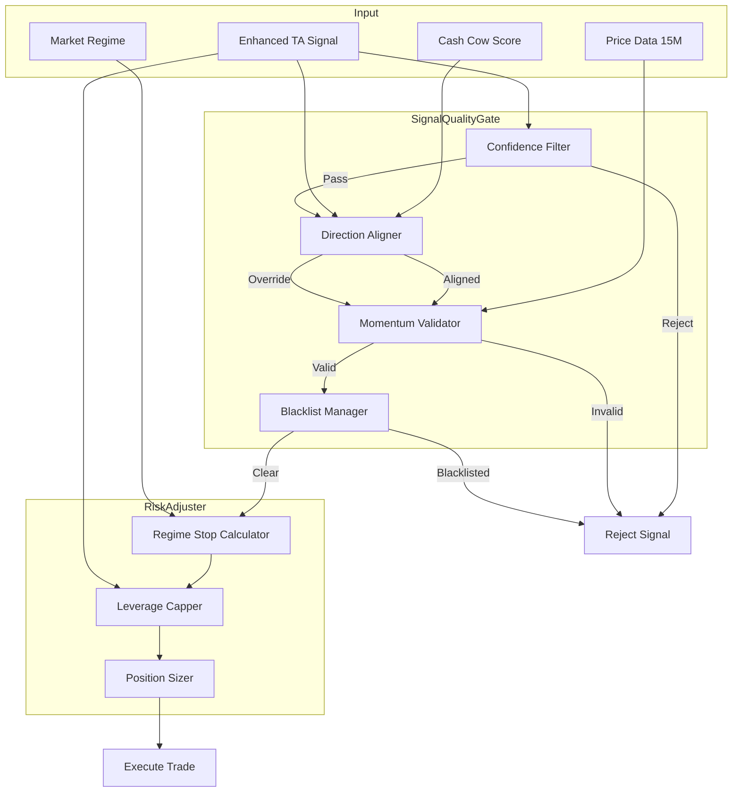

# Design Document: Signal Quality Fix

## Overview

This feature implements critical signal quality improvements to the Cash Cow trading bot to prevent trades against market direction and reduce premature stop-outs. The system introduces a Signal Quality Gate that validates Enhanced TA confidence, enforces direction alignment, manages symbol blacklisting, and applies regime-adaptive stop losses and leverage caps.

## Architecture



## Components and Interfaces

### 1. SignalQualityGate

Main orchestrator that validates signals before execution.

```python
@dataclass
class QualityGateResult:
    passed: bool
    direction: str  # Final direction to use
    rejection_reason: Optional[str]
    confidence_tier: str  # "high", "medium", "low"
    position_size_multiplier: float
    stop_loss_pct: float
    max_leverage: int

class SignalQualityGate:
    def __init__(self, config: QualityGateConfig):
        self.confidence_filter = ConfidenceFilter(config)
        self.direction_aligner = DirectionAligner()
        self.momentum_validator = MomentumValidator(config)
        self.blacklist_manager = BlacklistManager(config)
        self.risk_adjuster = RiskAdjuster(config)
    
    def evaluate(
        self,
        symbol: str,
        enhanced_signal: EnhancedSignal,
        cash_cow_direction: str,
        ohlcv_15m: List[OHLCV],
        regime: MarketRegime,
    ) -> QualityGateResult:
        """Evaluate signal through all quality gates."""
```

### 2. ConfidenceFilter

Filters signals based on Enhanced TA confidence thresholds.

```python
@dataclass
class ConfidenceFilterConfig:
    min_confidence: int = 50
    medium_confidence: int = 70
    high_confidence: int = 70

class ConfidenceFilter:
    def filter(self, confidence: int) -> Tuple[bool, str, float]:
        """
        Returns: (passed, tier, size_multiplier)
        - Below 50: rejected
        - 50-70: medium tier, 0.5x size
        - Above 70: high tier, 1.0x size
        """
```

### 3. DirectionAligner

Ensures trade direction matches Enhanced TA signal.

```python
class DirectionAligner:
    def align(
        self,
        enhanced_direction: str,
        cash_cow_direction: str,
    ) -> str:
        """
        Always returns Enhanced TA direction.
        Logs warning if Cash Cow conflicts.
        """
```

### 4. MomentumValidator

Validates recent price momentum supports signal direction.

```python
@dataclass
class MomentumValidatorConfig:
    contradiction_threshold_pct: float = 0.5
    overbought_rsi: float = 70.0
    oversold_rsi: float = 30.0

class MomentumValidator:
    def validate(
        self,
        direction: str,
        ohlcv_15m: List[OHLCV],
        rsi_15m: float,
    ) -> Tuple[bool, Optional[str]]:
        """
        Returns: (valid, rejection_reason)
        Checks:
        - 3-candle price change doesn't contradict direction by >0.5%
        - RSI not overbought for LONG (>70)
        - RSI not oversold for SHORT (<30)
        """
```

### 5. BlacklistManager

Manages symbol blacklisting after consecutive losses.

```python
@dataclass
class BlacklistConfig:
    max_consecutive_losses: int = 3
    loss_window_minutes: int = 60
    blacklist_duration_minutes: int = 30

class BlacklistManager:
    def __init__(self, config: BlacklistConfig):
        self._blacklist: Dict[str, datetime] = {}
        self._loss_history: Dict[str, List[datetime]] = {}
    
    def record_loss(self, symbol: str) -> None:
        """Record a stop-loss for symbol."""
    
    def is_blacklisted(self, symbol: str) -> bool:
        """Check if symbol is currently blacklisted."""
    
    def cleanup_expired(self) -> None:
        """Remove expired blacklist entries."""
```

### 6. RiskAdjuster

Calculates regime-adaptive stop losses and leverage caps.

```python
@dataclass
class RiskAdjusterConfig:
    trending_stop_pct: float = 3.0
    sideways_stop_pct: float = 4.0
    choppy_stop_pct: float = 5.0
    max_leverage_favorable: int = 20
    max_leverage_unfavorable: int = 10
    favorable_confidence_threshold: int = 70

class RiskAdjuster:
    def calculate_stop_loss(self, regime: MarketRegime) -> float:
        """Return stop loss percentage based on regime."""
    
    def calculate_max_leverage(
        self,
        regime: MarketRegime,
        confidence: int,
    ) -> int:
        """Return max leverage based on conditions."""
```

### 7. MicroTimeframeAnalyzer

Analyzes 1M and 5M charts for precise entry timing.

```python
@dataclass
class MicroAnalysisResult:
    trend_1m: str  # "UP", "DOWN", "SIDEWAYS"
    trend_5m: str
    micro_aligned: bool  # Both align with signal direction
    micro_bonus: int  # +10 if aligned, 0 otherwise
    should_reject: bool  # True if contradicting signal

class MicroTimeframeAnalyzer:
    def analyze(
        self,
        ohlcv_1m: List[OHLCV],
        ohlcv_5m: List[OHLCV],
        signal_direction: str,
    ) -> MicroAnalysisResult:
        """
        Analyze 1M and 5M trends for entry timing.
        - Calculate EMA9/EMA21 crossover on both timeframes
        - Check if micro trends align with signal direction
        - Return bonus or rejection based on alignment
        """
```

### 8. BreakoutDetector

Detects volume surges and price breakouts.

```python
@dataclass
class BreakoutResult:
    is_volume_surge: bool  # Volume > 200% of 20-period avg
    is_breakout: bool  # Price broke resistance with volume
    breakout_bonus: int  # +15 for confirmed breakout
    use_tight_trailing: bool  # True for breakout trades

class BreakoutDetector:
    VOLUME_SURGE_THRESHOLD = 2.0  # 200% of average
    BREAKOUT_BONUS = 15
    
    def detect(
        self,
        current_price: float,
        resistance_level: float,
        volume_ratio: float,
        prev_close: float,
    ) -> BreakoutResult:
        """
        Detect volume surges and breakouts.
        - Volume surge: current volume > 200% of 20-period average
        - Breakout: price > resistance AND volume surge
        """
```

## Data Models

```python
@dataclass
class QualityGateConfig:
    # Confidence thresholds
    min_confidence: int = 50
    medium_confidence: int = 70
    
    # Momentum validation
    contradiction_threshold_pct: float = 0.5
    overbought_rsi: float = 70.0
    oversold_rsi: float = 30.0
    
    # Blacklist settings
    max_consecutive_losses: int = 3
    loss_window_minutes: int = 60
    blacklist_duration_minutes: int = 30
    
    # Risk settings
    trending_stop_pct: float = 3.0
    sideways_stop_pct: float = 4.0
    choppy_stop_pct: float = 5.0
    max_leverage_favorable: int = 20
    max_leverage_unfavorable: int = 10
    
    # Micro-timeframe settings
    micro_alignment_bonus: int = 10
    
    # Breakout settings
    volume_surge_threshold: float = 2.0
    breakout_bonus: int = 15

@dataclass
class LossRecord:
    symbol: str
    timestamp: datetime
    entry_price: float
    exit_price: float
    loss_pct: float

@dataclass
class MicroAnalysisResult:
    trend_1m: str
    trend_5m: str
    micro_aligned: bool
    micro_bonus: int
    should_reject: bool

@dataclass
class BreakoutResult:
    is_volume_surge: bool
    is_breakout: bool
    breakout_bonus: int
    use_tight_trailing: bool
```

## Correctness Properties

*A property is a characteristic or behavior that should hold true across all valid executions of a system-essentially, a formal statement about what the system should do. Properties serve as the bridge between human-readable specifications and machine-verifiable correctness guarantees.*

### Property 1: Confidence-Based Signal Filtering

*For any* Enhanced TA signal with confidence score C:
- If C < 50, the signal SHALL be rejected
- If 50 ≤ C < 70, position size multiplier SHALL be 0.5
- If C ≥ 70, position size multiplier SHALL be 1.0

**Validates: Requirements 1.1, 1.2, 1.3**

### Property 2: Direction Enforcement

*For any* trade signal where Enhanced TA direction is D_enhanced and Cash Cow direction is D_cashcow:
- The final trade direction SHALL always equal D_enhanced regardless of D_cashcow

**Validates: Requirements 2.1, 2.2, 2.3**

### Property 3: Blacklist Lifecycle

*For any* symbol S with loss history:
- If S has 3+ stop-losses within 60 minutes, S SHALL be blacklisted
- While S is blacklisted, is_blacklisted(S) SHALL return True
- After 30 minutes, is_blacklisted(S) SHALL return False

**Validates: Requirements 3.1, 3.2, 3.3**

### Property 4: Regime-Based Stop Loss

*For any* market regime R:
- If R is CHOPPY, stop_loss_pct SHALL be 5.0
- If R is SIDEWAYS, stop_loss_pct SHALL be 4.0
- If R is TRENDING, stop_loss_pct SHALL be 3.0

**Validates: Requirements 4.1, 4.2, 4.3**

### Property 5: Momentum Validation

*For any* signal with direction D, 15M price data, and RSI value:
- If 3-candle price change contradicts D by >0.5%, signal SHALL be rejected
- If D is LONG and RSI > 70, signal SHALL be rejected
- If D is SHORT and RSI < 30, signal SHALL be rejected

**Validates: Requirements 5.1, 5.2, 5.3**

### Property 6: Leverage Capping

*For any* trade with regime R and confidence C:
- If R is CHOPPY or SIDEWAYS, max_leverage SHALL be ≤ 10
- If C < 60, max_leverage SHALL be ≤ 10
- If R is TRENDING and C ≥ 70, max_leverage SHALL be ≤ 20

**Validates: Requirements 6.1, 6.2, 6.3**

### Property 7: Micro-Timeframe Alignment

*For any* signal with direction D and 1M/5M trend data:
- If both 1M and 5M trends align with D, micro_bonus SHALL be 10
- If either 1M or 5M contradicts D, should_reject SHALL be True

**Validates: Requirements 7.2, 7.3**

### Property 8: Volume Surge and Breakout Detection

*For any* price/volume data with resistance level R:
- If volume_ratio > 2.0, is_volume_surge SHALL be True
- If price > R AND is_volume_surge, is_breakout SHALL be True AND breakout_bonus SHALL be 15

**Validates: Requirements 8.1, 8.2, 8.3**

## Error Handling

| Error Condition | Handling Strategy |
|----------------|-------------------|
| Missing Enhanced TA signal | Reject trade, log warning |
| Invalid OHLCV data | Skip momentum validation, proceed with caution |
| Blacklist storage failure | Continue without blacklist (fail-open for trading) |
| Regime detection failure | Default to CHOPPY (most conservative) |

## Testing Strategy

### Property-Based Testing

The system will use **Hypothesis** for property-based testing in Python.

Each property test will:
1. Generate random valid inputs using Hypothesis strategies
2. Execute the component under test
3. Verify the property holds for all generated inputs
4. Run minimum 100 iterations per property

Property tests will be tagged with format: `**Feature: signal-quality-fix, Property {N}: {description}**`

### Unit Tests

Unit tests will cover:
- Edge cases at confidence boundaries (49, 50, 70, 71)
- Blacklist timing edge cases
- RSI boundary conditions (29, 30, 70, 71)
- Price change threshold boundaries

### Integration Tests

Integration tests will verify:
- Full signal flow through all gates
- Interaction between Cash Cow engine and Quality Gate
- Blacklist persistence across trading cycles
