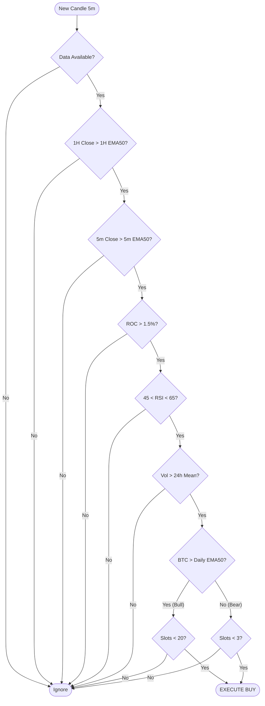
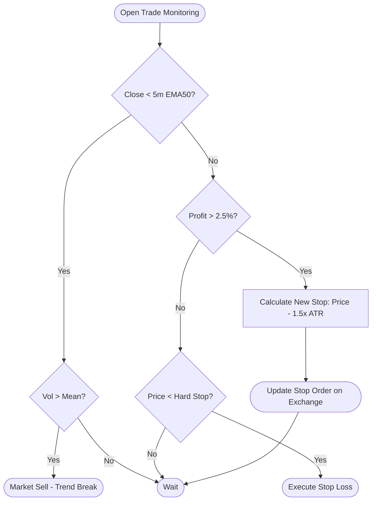

This is a professional **Product Design Document (PDD)** and **Technical Specification**. It is written for a Senior DevOps/Python Engineer to implement immediately.

It transforms our strategy discussions into a rigid engineering blueprint using **Mermaid diagrams**, **Module definitions**, and **Algorithmic workflows**.

---

# PRODUCT & TECHNICAL SPECIFICATION
## PROJECT: KINETIC EMPIRE (v1.0)
**Type:** Automated High-Frequency Asset Management System
**Core Framework:** Freqtrade (Python)
**Deployment:** Docker / Cloud VPS

---

## 1. EXECUTIVE SUMMARY

**Kinetic Empire** is an algorithmic trading system designed to capitalize on high-velocity crypto assets while prioritizing capital preservation. Unlike static bots, this system is **regime-aware** (adjusting exposure based on macro trends) and **self-optimizing** (adjusting bet sizes based on historical win rates per asset).

### Key Performance Indicators (KPIs)
*   **Target Win Rate:** > 60% in Bull Regimes.
*   **Max Drawdown:** < 15% (Enforced by Regime Filter).
*   **Sharpe Ratio:** > 2.0.
*   **Uptime:** 99.9% (24/7 Operation).

---

## 2. SYSTEM ARCHITECTURE

The system is built on a microservices architecture using Docker. It isolates the execution engine from the data layer and monitoring interfaces.

```mermaid
graph TD
    subgraph "External World"
        Exchange[Binance Futures API]
        User[User / Admin]
    end

    subgraph "Kinetic Empire Host (Docker)"
        direction TB
        
        CCXT[CCXT Execution Layer]
        
        subgraph "Freqtrade Core"
            DataFetcher[Data Provider & Normalizer]
            Strategy[Strategy Engine (KineticEmpire.py)]
            RiskMod[Risk Management Module]
            Pairlist[Dynamic Pairlist Scanner]
        end
        
        DB[(SQLite / Postgres DB)]
        
        Telegram[Telegram Bot API]
    end

    %% Data Flow
    Exchange <-->|Websocket/REST| CCXT
    CCXT <--> DataFetcher
    DataFetcher --> Strategy
    DataFetcher --> Pairlist
    
    %% Logic Flow
    Pairlist -->|Whitelist| Strategy
    Strategy -->|Signal| RiskMod
    RiskMod -->|Validated Order| CCXT
    
    %% Persistence
    Strategy -->|Trade History| DB
    RiskMod -->|Wallets/Positions| DB
    
    %% User Interaction
    User <-->|Commands/Alerts| Telegram
    Telegram <--> Strategy
```

---

## 3. FUNCTIONAL MODULES

### A. The Scanner (Dynamic Pairlist Module)
**Responsibility:** Filter the 1000+ available coins down to the top 20 "Tradeable Assets" based on volatility and quality.

*   **Refresh Rate:** Every 30 minutes.
*   **Filter Pipeline:**
    1.  **Static Filter:** Remove Blacklisted coins (Stablecoins, Leverage tokens).
    2.  **Volume Filter:** Select Top 70 coins by Quote Volume (USDT).
    3.  **Spread Filter:** Max Spread ratio `0.005` (0.5%).
    4.  **Price Filter:** Min Price `$0.001` (Anti-spam).
    5.  **Volatility Filter:** Sort by Volatility (High to Low). Range: `0.02` to `0.50`.
    6.  **Performance Filter:** Asset must be positive (`> 0%`) in the last 60 minutes.
    7.  **Limit:** Keep Top 20.

### B. The Strategy Engine (Signal Logic)
**Responsibility:** Analyze the Whitelisted pairs on 5m and 1h timeframes to generate Buy/Sell signals.

*   **Inputs:** OHLCV Data (Open, High, Low, Close, Volume).
*   **Indicators:**
    *   `EMA_50` (5m & 1h) - Trend Baseline.
    *   `ROC_12` (Rate of Change) - Momentum Velocity.
    *   `RSI_14` - Overbought/Oversold levels.
    *   `ATR_14` - Volatility measurement.

### C. The Risk Shield (Regime & Sizing)
**Responsibility:** The "Governor" that approves or rejects trades based on account health and market conditions.

*   **Regime Filter:** Checks `BTC/USDT` Daily Candle vs `EMA_50`.
    *   *Bear:* Max 3 Trades.
    *   *Bull:* Max 20 Trades.
*   **Kelly Criterion Sizing:**
    *   Calculates `Win_Rate` per pair (Last 20 trades).
    *   Scales stake size from 0.5% (Losers) to 5.0% (Winners).
*   **Stop Loss Engine:**
    *   Calculates dynamic `2.0 * ATR` stop loss.

---

## 4. ALGORITHMIC WORKFLOWS

### Workflow 1: The Entry Decision Loop
This logic runs on every candle (5 minutes) for every Whitelisted pair.



### Workflow 2: The Exit & Trailing Loop
This runs continuously for every open trade.



---

## 5. TECHNICAL IMPLEMENTATION DETAILS

### A. Configuration (`config.json`)
The developer must configure the following core parameters:

```json
{
  "max_open_trades": 20,
  "stake_currency": "USDT",
  "stake_amount": "unlimited",
  "tradable_balance_ratio": 0.99,
  "fiat_display_currency": "USD",
  "dry_run": false,
  "cancel_open_orders_on_exit": false,
  "unfilledtimeout": {
    "entry": 10,
    "exit": 30
  },
  "order_types": {
    "entry": "limit",
    "exit": "limit",
    "emergency_exit": "market",
    "stoploss": "market",
    "stoploss_on_exchange": true
  },
  "exchange": {
    "name": "binance",
    "key": "API_KEY",
    "secret": "API_SECRET",
    "ccxt_config": {"enableRateLimit": true},
    "ccxt_async_config": {
      "enableRateLimit": true,
      "rateLimit": 200
    },
    "pair_whitelist": [],
    "pair_blacklist": ["BNB/.*", ".*DOWN/.*", ".*UP/.*", "USDC/.*"]
  }
}
```

### B. Python Strategy Code Structure
The developer must implement `KineticEmpire.py` inheriting from `IStrategy`.

**Critical Methods to Implement:**
1.  `informative_pairs()`: Must append `("BTC/USDT", "1d")`.
2.  `populate_indicators()`: Must use `merge_informative_pair` to blend 1H/Daily data into 5m dataframe.
3.  `custom_stake_amount()`: Must implement the Kelly Criterion logic querying `Trade.get_trades_proxy(pair=pair)`.
4.  `custom_stoploss()`: Must implement ATR calculation using `dataframe['atr'].iloc[-1]`.

---

## 6. DEPLOYMENT & OPERATIONS

### A. Infrastructure Requirements
*   **VPS:** AWS t3.medium or DigitalOcean Droplet (4GB RAM, 2 vCPU).
*   **OS:** Ubuntu 22.04 LTS.
*   **Container Engine:** Docker Engine + Docker Compose.

### B. Deployment Commands
```bash
# 1. Clone Repo & Setup
git clone https://github.com/freqtrade/freqtrade.git
cd freqtrade
./setup.sh --install

# 2. Inject Strategy
cp KineticEmpire.py user_data/strategies/

# 3. Configure
cp config.json.example user_data/config.json
# (Edit config.json with your API keys)

# 4. Build & Run
docker-compose up -d --build
```

### C. Monitoring Dashboard
*   Use FreqUI (Built-in Web Interface) on Port 8080.
*   Connect Telegram Bot for critical alerts:
    *   `/status` - Check open trades.
    *   `/profit` - Check daily PnL.
    *   `/stop` - Emergency Kill Switch.

---

## 7. RISK DISCLOSURE & EDGE CASES

### Edge Case 1: API Downtime
**Protocol:** If Binance API returns 5xx errors for > 5 minutes, the bot will enter `FailSafe` mode and stop processing new signals. Existing stops reside on the exchange engine (thanks to `stoploss_on_exchange: true`), securing positions even if the bot dies.

### Edge Case 2: Flash Crash
**Protocol:** If BTC drops > 5% in 1 hour:
1.  Regime Filter immediately detects `Close < EMA50` (Daily/4H depending on tuning).
2.  Max trades reduced to 3.
3.  Dynamic Stops trigger.
4.  No new Buy orders generated until stability returns.

### Edge Case 3: Data Drift
**Protocol:** The Kelly Criterion requires at least 10 closed trades per pair. Before this threshold, the bot defaults to a conservative **1% stake**. This prevents "betting big" on unproven assets.

---

**Signed Off By:** ____________________ (Lead Architect)
**Date:** 2023-10-27
**Version:** 1.0 - Kinetic Empire Release